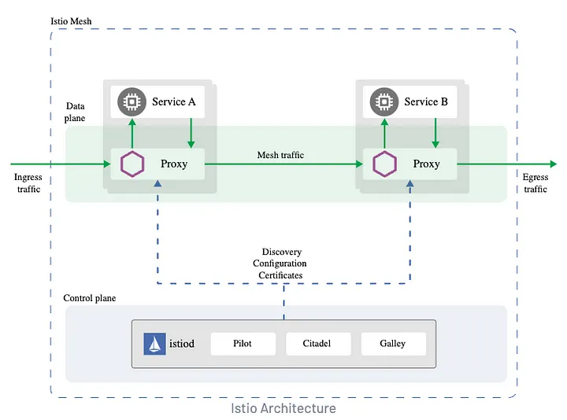

# Microservices in Kubernetes

## Part 1: Setting Up Django with Kubernetes: A Microservices Architecture Guide

Welcome to a comprehensive guide on leveraging Django alongside Kubernetes to architect and deploy microservices. This guide is tailored for developers aiming to enhance the performance of Django applications and those keen on mastering the deployment intricacies of microservices. By the end of this walkthrough, you'll have the knowledge to integrate Django, a high-level Python web framework, with Kubernetes, the leading container orchestration platform, thus scaling and flexibilizing your development process.

### Contents

- [Introduction](#introduction)
- [Containerizing Django Application](#containerizing-django-application)
- [Setting Up a Kubernetes Cluster](#setting-up-a-kubernetes-cluster)
- [Defining Kubernetes Deployments and Services](#defining-kubernetes-deployments-and-services)
- [Conclusion](#conclusion)
- [Command Summary](#command-summary)

### Introduction

Combining Django's robustness with Kubernetes' scalability opens new avenues for building and managing web applications. This guide explores setting up Django within a microservices architecture using Kubernetes, aiming at scalability and flexibility.

### Containerizing Django Application

#### Step 1: Dockerize Your Django Application

1. **Create a Dockerfile**: Define your application's environment, dependencies, and execution instructions.
    ```Dockerfile
    FROM python:3.10
    WORKDIR /usr/src/app
    ENV PYTHONDONTWRITEBYTECODE=1
    ENV PYTHONUNBUFFERED=1
    RUN pip3 install --upgrade pip
    COPY ./requirements.txt /usr/src/app
    RUN pip3 install -r requirements.txt
    COPY . .
    RUN python manage.py migrate
    EXPOSE 8000
    CMD ["gunicorn", "core.wsgi:application", "--bind", "0.0.0.0:8000"]
    ```
    - Utilizes `python:3.10` as the base image.
    - Installs dependencies from `requirements.txt`.
    - Sets the container to run Django migrations and start with Gunicorn.

2. **Build Docker Image**: Tag your Docker image for identification.
    ```bash
    docker build -t service1 .
    ```

### Setting Up a Kubernetes Cluster

#### Step 2: Kubernetes Cluster Configuration

1. **Select Kubernetes Provider**: Choose from options like Google Kubernetes Engine, Amazon Elastic Kubernetes Service, or Minikube for local setups.
2. **Install kubectl**: Use Docker Desktop for an integrated Kubernetes experience, enabling it in settings.

### Defining Kubernetes Deployments and Services

#### Step 3: Kubernetes Deployment and Service Manifests

1. **Create Deployment Manifest**: Define the application deployment strategy, ensuring a single replica for simplicity.
    ```yaml
    apiVersion: apps/v1
    kind: Deployment
    metadata:
      name: service1-deployment
      labels:
        app: service1
    spec:
      replicas: 1
      selector:
        matchLabels:
          app: service1
      template:
        metadata:
          labels:
            app: service1
        spec:
          containers:
          - name: service1-svc
            image: service1:latest
            imagePullPolicy: Never
            ports:
            - containerPort: 8000
    ```

2. **Service Resource Configuration**: Implement a stable networking endpoint via a Kubernetes Service.
    ```yaml
    apiVersion: v1
    kind: Service
    metadata:
      name: service1
    spec:
      type: LoadBalancer
      ports:
      - protocol: TCP
        port: 8000
        targetPort: 8000
      selector:
        app: service1
    ```
    - This manifest provisions an external load balancer, exposing the service externally.

3. **Apply Manifests**: Deploy your configurations to Kubernetes.
    ```bash
    kubectl apply -f k8s/development.yaml
    ```

### Conclusion

Integrating Django with Kubernetes in a microservices architecture enhances scalability and flexibility. This guide covered the essential steps from containerizing your Django application to deploying it on a Kubernetes cluster and ensuring it's accessible through a stable network endpoint.

## Part 2: Integrating Django with Istio and API Gateway for Enhanced Microservices Security

Welcome to the guide on bolstering your microservices' security by integrating Django, Istio, and API Gateway. This part of our series focuses on authentication and authorization, central pillars of microservices security. We'll navigate through the setup and configuration processes to ensure a secure, efficient communication flow between services.

### Istio Architecture Overview


Imagine you have a big, complex building with lots of rooms and people moving around. Now, Istio is like a super smart security system for this building. It’s designed to keep everything safe, organized, and running smoothly.

In simple terms, Istio acts as a middleman between different parts of your application, making sure they can communicate securely and efficiently. It’s like a traffic cop that directs the flow of data between different services inside your building (microservices). It helps with things like traffic management, security, and monitoring, so you can focus on building your application without worrying too much about these technical details.

The architecture of Istio is like a set of interconnected components. The main ones are:

- **Data Plane**: This is where the action happens. It consists of a set of sidecar proxies (small assistants) that are automatically injected into each microservice. These proxies handle the communication between services, making sure everything is secure and reliable.
- **Control Plane**: This is the brain of Istio. It includes different components that manage and configure the sidecar proxies. They decide how traffic should be routed, which security policies to enforce, and how to collect data for monitoring and analysis.
- **Istiod**: Think of this as the mastermind behind the scenes. It coordinates and manages all the configuration details for the entire Istio system.

When your application runs, Istio helps ensure that data flows between services are safe from unauthorized access, that requests are evenly distributed to avoid overloading some parts of the system, and that any issues are detected and reported for quick troubleshooting.

Overall, Istio simplifies the way you manage the complexities of microservices and keeps your application secure and running smoothly like a well-organized building with a top-notch security system.

### Installing Istio in Kubernetes

Before diving into the technical setup, ensure your Kubernetes cluster is operational, and `kubectl` commands are functional. Follow these steps to install Istio:

1. **Clone the Istio-Gateway Repository**:
   ```bash
   cd son_namespace/deploy/istio/istio-gateway
   ```
   
2. **Download and Install Istio**:
   For Linux or macOS, use the following command to download and install Istio:
   ```bash
   wget https://github.com/istio/istio/releases/download/1.20.2/istio-1.20.2-linux-amd64.tar.gz
   tar -xzvf istio-1.20.2-linux-amd64.tar.gz
   mv istio-1.20.2/bin/istioctl /usr/local/bin/
   ```
   Verify the installation by typing `istioctl version`.

3. **Apply the Demo Configuration Profile**:
   ```bash
   istioctl install --set profile=demo -y
   istioctl verify-install
   ```

4. **Create and Configure the `development` Namespace**:
   ```bash
   kubectl create namespace development
   kubectl label namespace development istio-injection=enabled
   ```

### Configuring the Gateway and Policies

#### Gateway Setup

The gateway configuration defines the entry point for external traffic into your service mesh. Apply the gateway configuration:
```bash
kubectl apply -f gateway.yaml
```

#### Authentication Policy

Authentication policy configures Istio to authenticate requests using JWT tokens. Apply the authentication policy:
```bash
kubectl apply -f authentication-policy.yaml
```

#### Authorization Policy

Authorization policy controls access based on roles defined in the JWT tokens. Apply the authorization policy:
```bash
kubectl apply -f authorization-policy.yaml
```

### AuthService Implementation

Finally, set up the AuthService to handle user authentication:

1. **Clone and Build the AuthService**:
   ```bash
   git clone https://github.com/shashank-singh84335/authservice.git
   docker build -t authservice .
   ```

2. **Deploy AuthService in Kubernetes**:
   ```bash
   kubectl apply -f k8s/development.yaml
   ```

3. **Accessing the AuthService**:
   Navigate to `http://127.0.0.1/auth/v1/swagger/` to interact with the AuthService API, including signup, signin, and password reset functionalities.

### Conclusion

This guide walked you through integrating Istio with a Django authentication service within a Kubernetes environment, enhancing your microservices' security with robust authentication and authorization mechanisms. Istio's architecture simplifies microservices management, ensuring secure, efficient inter-service communication. Stay tuned for more insights into leveraging open-source technologies to secure and scale your applications.


## Addtional Resources

[microservices-example](https://github.com/nishantwrp/microservices-example)

[Google Microservices demo](https://github.com/GoogleCloudPlatform/microservices-demo)