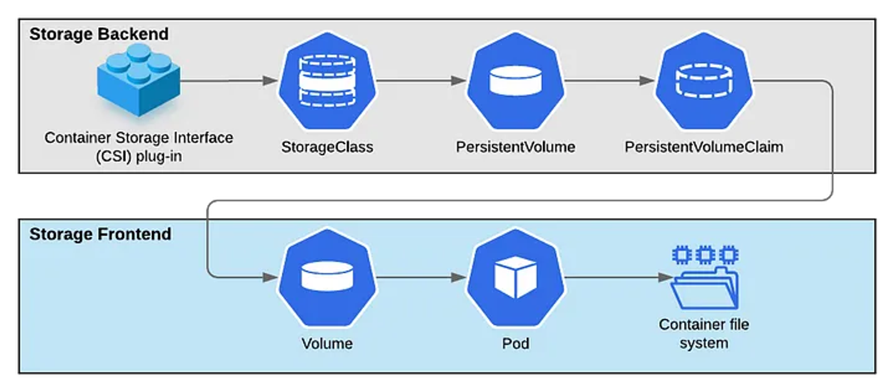
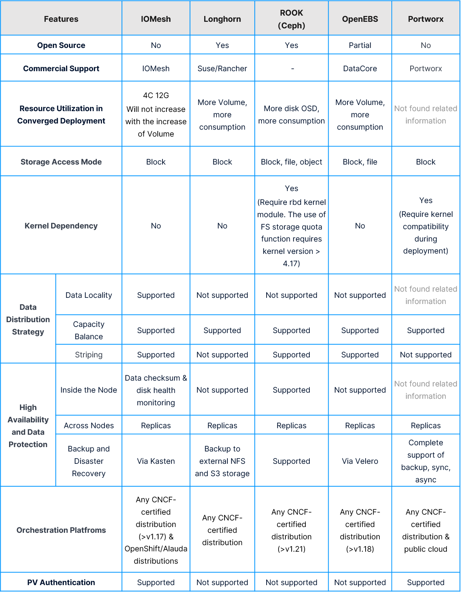

# Kubernetes Storage on Bare Metal: A Comprehensive Guide

## Introduction
This guide provides an overview of handling storage in Kubernetes, especially in on-premises or bare-metal environments. Unlike cloud environments where storage services are readily available, dealing with storage on bare metal requires understanding Kubernetes' mechanisms for managing persistent data.

## Understanding Volumes in Kubernetes
At the core of Kubernetes storage are Volumes, which provide a way for containers within a pod to persist data beyond the lifecycle of an individual container.

### Types of Volumes
Kubernetes supports various volume types, each suited for different use cases. This guide focuses on two primary types:
- **ReadWriteOnce (RWO):** This type is akin to a block disk, such as AWS's EBS, attached to a single node and can be mounted by a single pod. It's ideal for databases and other stateful applications requiring exclusive access to their storage.
- **ReadWriteMany (RWX):** RWX volumes support file sharing across multiple nodes and pods, making them suitable for applications that need to share data, like web servers serving static content.

## Managing Storage in Kubernetes
Kubernetes abstracts the complexity of managing underlying storage through various resources and mechanisms, including PersistentVolumes (PVs), PersistentVolumeClaims (PVCs), and StorageClasses.

### Local and HostPath Volumes
For simpler use cases or development purposes, Kubernetes offers Local and HostPath volumes, allowing pods to access local filesystems on the node or specific paths.

### Cloud Provider Integration
Initially, Kubernetes included built-in (In-tree) support for cloud provider storage solutions, allowing seamless use of services like AWS EBS. However, to accommodate the growing diversity in storage solutions and cloud providers, Kubernetes has shifted towards a plugin-based approach (Out-of-Tree) using the Container Storage Interface (CSI).

### Container Storage Interface (CSI)
CSI enables Kubernetes to work with a wide range of storage systems by allowing third parties to develop plugins that Kubernetes can use to provision, mount, and manage storage.
Below is a table comparing various features of popular Kubernetes CSI options:

### Understanding the Table
This table evaluates several Kubernetes storage solutions across various key factors:
- **Open Source**: Indicates if the solution is open source.
- **Commercial Support**: Details on the availability and provider of commercial support.
- **Resource Utilization**: How resource consumption scales with volume.
- **Storage Access Mode**: Types of access modes supported (Block, File, Object).
- **Kernel Dependency**: Any specific kernel dependencies required by the solution.
- **Data Distribution Strategy**: Methods supported for distributing data.
- **High Availability and Data Protection**: Features available for ensuring data availability and protection.
- **Orchestration Platforms**: Compatibility with orchestration platforms like Kubernetes and OpenShift.
- **PV Authentication**: Support for persistent volume authentication.

### Notes on Specific Solutions
- **IOMesh**: A non-open source option with strong data locality and support for block storage.
- **Longhorn**: An open-source project backed by Suse/Rancher, lacking data locality but supporting block storage.
- **ROOK (Ceph)**: Open source and supports multiple storage modes with high availability across nodes.
- **OpenEBS**: Partially open source with DataCore support, offering block and file storage modes.
- **Portworx**: A non-open source solution with robust backup and disaster recovery features.

For a more detailed analysis of each solution and guidance on choosing the right one for your cluster, refer to the additional resources below.

## Use Cases and Examples
- **Databases on RWO Volumes:** Examples include deploying a PostgreSQL database using a PersistentVolumeClaim to request an RWO volume.
- **Shared Storage with RWX Volumes:** Demonstrating how to set up a shared file system for a web server cluster using RWX volumes.

## Additional Resources
- For an in-depth comparison and insights into the Kubernetes persistent storage landscape, you can read the article on [IOMesh's blog](https://www.iomesh.com/blog/kubernetes_persistent_storage_comparison).
- To explore more on Kubernetes storage and to understand practical implications, visit [Thuongnn's Medium post](https://thuongnn.medium.com/note-v%E1%BB%81-kubernetes-storage-b9ab0b58e2bc).

